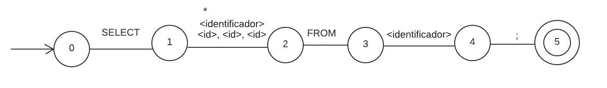
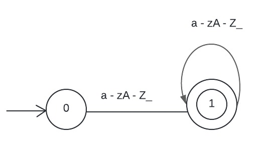

# Implementación de un Autómata Finito Determinista

Los Autómatas Finitos Deterministas (AFD) son modelos computacionales que se utilizan ampliamente en el análisis léxico y sintáctico de lenguajes formales, incluyendo lenguajes de programación y consulta como SQL. En el contexto del reconocimiento de sentencias SQL, un AFD puede ser una herramienta poderosa para validar la estructura básica de las consultas.

Una sentencia SQL, especialmente una consulta SELECT, sigue una estructura definida que se presta bien para el análisis mediante un AFD. La idea principal es modelar los diferentes componentes de una consulta SQL (palabras clave e identificadores) como estados en el autómata, y las transiciones entre estos estados representan la progresión lógica de una consulta SQL bien formada.



Este AFD se utiliza para reconocer la estructura de la sentencia SELECT en SQL. Este tipo de autómata se compone de un conjunto finito de estados, un alfabeto finito de símbolos de entrada, una función de transición que define cómo se mueve de un estado a otro en función de la entrada, un estado inicial y uno o más estados de aceptación.



Este AFD está diseñado para reconocer nombres válidos de tablas o columnas en una base de datos.
Este autómata asegura que los nombres pueden contener letras alfabéticas (minúsculas y mayúsculas) y guiones bajos, proporcionando una flexibilidad comúnmente permitida en los nombres de tablas y columnas en muchas bases de datos.

## Inicializar proyecto

- Primero clonar el repositorio:

```bash
git clone https://github.com/angelchavezinformatica/afd-select-sql.git
```

- Ejecutar los tests

```bash
python -m unittest discover
```

## Integrantes

- Chávez García Angel Emanuel
- Costa Mallqui Dayanara Darlene
- Gamarra Saucedo Maeli Sabina
- Rojas Delgado Norma Katerine
- Sánchez Abanto Félix Aladino
